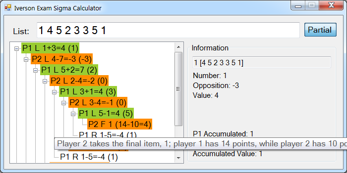

Iverson Exam Sigma Calculator
===========

This calculates the value of a list for the sigma game from the [2013 Iverson Exam](https://www.ualberta.ca/computing-science/explore/iverson-exam/preparation-exams-and-results.html).

It also allows you to browse the entire decision tree.



Licence
-----------
This project is licensed under the GPL v3 licence.

The logo is from Everaldo Coelho's Crystal Project Icons, which is licensed under the LGPL.

Excerpt from [Official Solution](https://www.ualberta.ca/computing-science/media-library/outreach/iverson/iverson2013sol.pdf)
-----------
**question 4: sigma game**

Alice and Bob play a game called *sigma*. The input is a list of numbers. Alice goes first. They
alternate turns. On a turn, a player takes (and removes) either the first number or last number
from the list. The game ends when all numbers are gone. A player’s score is the sum of the
numbers they took. The player with the greater score wins.

&nbsp;&nbsp;Example: list `[2 5 1 4]`. Alice takes 4, leaving `[2 5 1]`. Bob takes 2, leaving `[5 1]`. Alice
takes 5, leaving `[1]`. Bob takes `1`. Alice scores `4+5=9`. Bob scores `2+1=3`. Alice wins.

&nbsp;&nbsp;A player is *sane* if she maximizes the minimum score that she is guaranteed against all possible
opponent strategies.

&nbsp;&nbsp;Example: `[5 1]`. If Alice is sane then she takes 5 and scores 5 (otherwise she takes 1 and
scores 1).

&nbsp;&nbsp;Example: `[1 2 4]`. If Alice is sane then she takes 4.

&nbsp;&nbsp;The value of a list is, for the game with that list, the score of the first player minus the score
of the second player, assuming that each player is sane.

&nbsp;&nbsp;Examples: value of `[5]` is `5-0=5`; value of `[5 1]` is `5-1=4`; value of `[1 2 4]` is `5-2=3`.

(a) [2 marks] Give the value of each list:

| List        | Value |
|-------------|------:|
| [1 5 2]     | -2    |
| [1 5 2 4]   | 6     |
| [3 1 5 2]   | 5     |
| [3 1 5 2 4] | -1    |

(b) [2 marks] Bob says that a best strategy is to always take the larger available number, or
either one if they are equal. Alice says Bob is wrong. Who is correct? Justify your answer.

> Alice is correct. For [1 1 100 2], Alice’s scores -98 if she takes 2,
> but 98 if she takes 1.

(c) [3 marks] The value of a list can be computed from the values of its sublists. Fill in the
empty cells of the array, which give sublist values of `[1 4 5 2 3 3 5 1]`. The entry in row *x*
and column *y* is the value of the sublist from position *x* to position *y*. E.g., the entry in the
second row and fourth column is the value of sublist `[4 5 2]`, namely 1.

    1  3  2  0  3  0  5  4
       4  1  1  2  1  4 -3
          5  3  4  3  2  7
             2  1  2  3 -2
                3  0  5  4
                   3  2 -1
                      5  4
                         1

(d) [3 marks] Write code that takes as input a list and returns the list’s value.

```python
def score(L):               # compute the value of list L
  n = len(L)                # list L has n numbers, indexed 0..n-1
  for j in range(n):           # j runs from 0 to n-1
    Value[j][j] = L[j]
  for gap in range(1,n):       #gap runs from 1 to n-1
    for x in range(n-gap):     #x runs from 0 to (n-gap)-1
      y = x+gap
      Value[x][y] = max( L[x] - Value[x+1][y], L[y] - Value[x][y-1] )
  return Value[0][n-1]
```
